Here’s a detailed and well-structured `README.md` for your project **F.A.R.M (Future of Agriculture with Revolutionary Model)**, incorporating markdown formatting, animations/graphics suggestions, and clear sections.

---

# 🌾 F.A.R.M  
**Future of Agriculture with Revolutionary Model**  

Empowering farmers with AI-driven insights for sustainable and efficient farming. F.A.R.M leverages advanced technologies like **LLMs**, **Deep Learning**, and **Machine Learning** to revolutionize agriculture, offering features like crop disease detection, irrigation advice, multilingual interaction, and more.

---

## 🌟 Features

- 🌐 **Multilingual Chatbot**:  
  Farmers can communicate via **voice** or **text** in multiple languages.

- 🧑‍🌾 **Smart Query Analysis**:  
  Queries are processed by **LLMs**, which delegate tasks to specialized agents.

- 📷 **Crop Disease Detection**:  
  Upload images for disease analysis using a **Deep Learning model**.

- 🌦️ **Irrigation Advice**:  
  Location-based weather analysis and **rain prediction** models help decide if irrigation is needed.

- 📊 **Market Insights**:  
  Get real-time crop price updates and market trends.

- 🐛 **Pest Control Guidance**:  
  Receive suggestions for pest control measures tailored to crop and region.

---

## 🚀 How It Works

```mermaid
graph TD
  User[🌾 Farmer] --> |Voice/Text Input| Chatbot
  Chatbot --> |Analyze Query| LLM
  LLM --> |Assign Task| Agents
  Agents --> |Execute Functions| Functions
  Functions --> |Return Data| LLM
  LLM --> |Respond| Chatbot
  Chatbot --> |Deliver Insights| User
```



---

## 💻 Technologies Used

- **LLMs (Large Language Models)** for intelligent query processing.
- **Deep Learning** for image-based crop analysis.
- **Machine Learning** for weather predictions and irrigation advice.
- **APIs** to fetch real-time data (e.g., weather, market trends).
- **Multilingual NLP** for seamless regional communication.

---

## 🌐 Innovative Use Cases

- **Yield Prediction**: Anticipates crop yield based on various environmental factors.  
- **Soil Health Analysis**: Assesses soil conditions using sensor data.  
- **Fertilizer Recommendations**: Suggests optimal fertilizer usage for specific crops.  
- **Market Trend Forecasting**: Helps farmers plan better by predicting future trends.

---

## 🛠️ Getting Started

### Prerequisites
- Python 3.8 or higher
- Required libraries listed in `requirements.txt`

### Installation
1. Clone the repository:
   ```bash
   git clone https://github.com/yourusername/farm.git
   ```
2. Navigate to the project directory:
   ```bash
   cd farm
   ```
3. Install dependencies:
   ```bash
   pip install -r requirements.txt
   ```

### Running the Application
Start the chatbot:
```bash
python app.py
```

---

## 🤝 Contributions

We welcome contributions to make F.A.R.M better!  
Feel free to:
- Fork the repository.
- Create a new branch for your feature/bug fix.
- Submit a pull request with a detailed explanation.

---

## 📝 License

This project is licensed under the **MIT License**. See the [LICENSE](LICENSE) file for details.

---

## 📞 Contact

If you have any questions or need support, feel free to reach out:  
📧 Email: [saif_rehman08@yahoo.com](mailto:saif_rehman08@yahoo.com)

---

🎉 **Let’s transform the future of farming together with F.A.R.M!** 🌱

---

### 🔗 Useful Links
- [GitHub Repository](https://github.com/Saifix/F.A.R.M)
- [Project Demo Video](https://your-demo-link.com)

